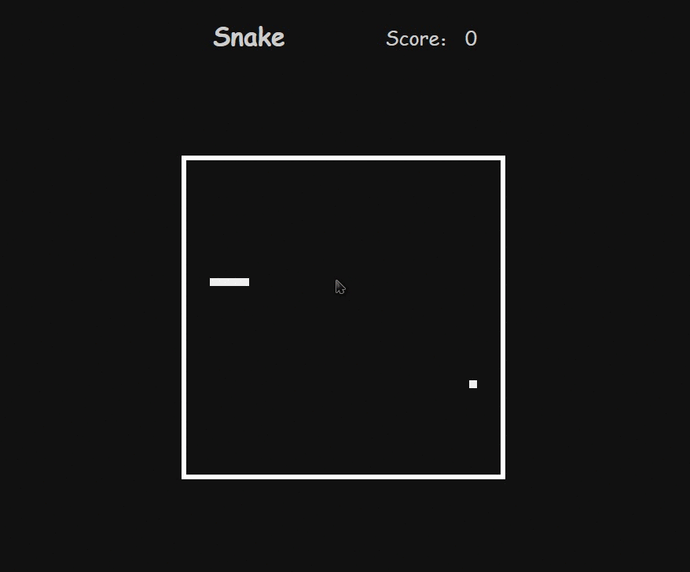
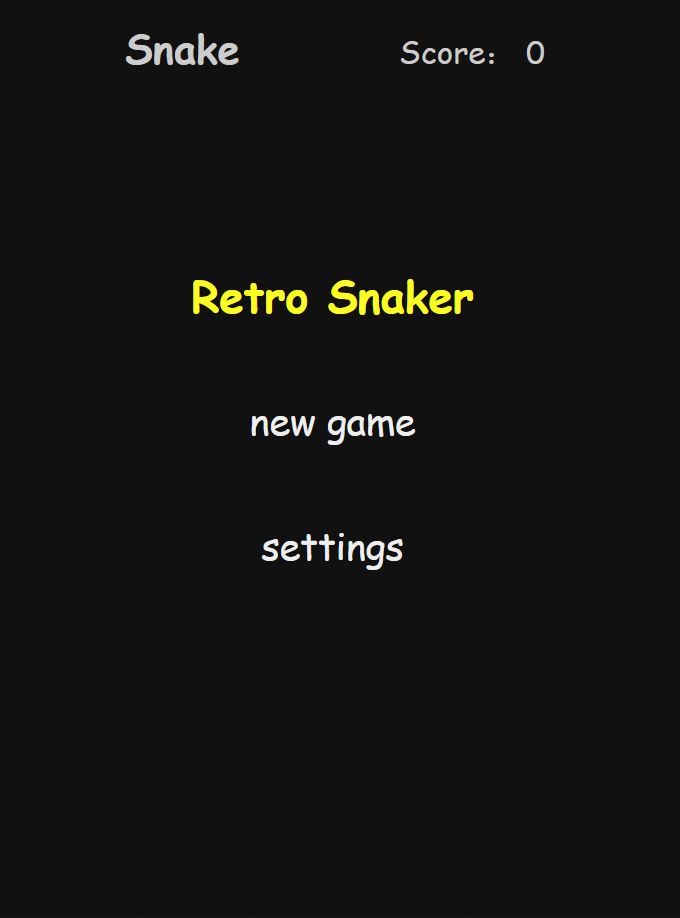
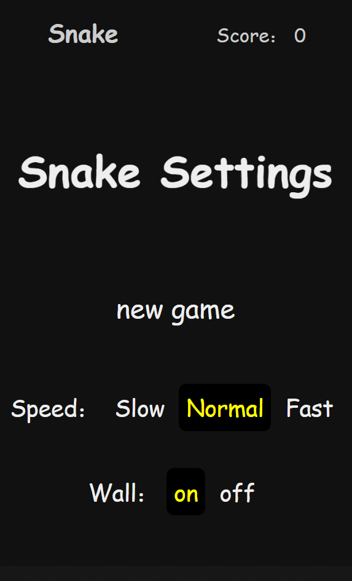

# Retro Snek

<p align="center">pure navtive JavaScript combined with canvas，no dependence</p>

The results are shown as follows：
# Show
<p align="center"></p> 

# Demo

[Demo Game](https://janko320000.github.io/Snek./)

# How to use

You can also clone this project and try it locally 

```
git clone https://github.com/janko320000/Snek..git
```

or use the `.zip`

I think the focus is on the idea of the program， I do not compress，you can see the original JS

# About settings

<p align="">
  
  
</p>

Main Function：

1. you can choose wall as an obstacle 「on」or「off」

2. you can choose speed the moving speed of the snake 「slow」「normal」or「fast」

And the other rules are the same as the snake rules played in childhood 

Such as：

- You can eat your body or hit the wall to kill yourself （under the wall model）

- According to how much food you eat to increase the length of the snake
