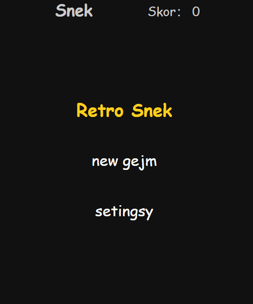
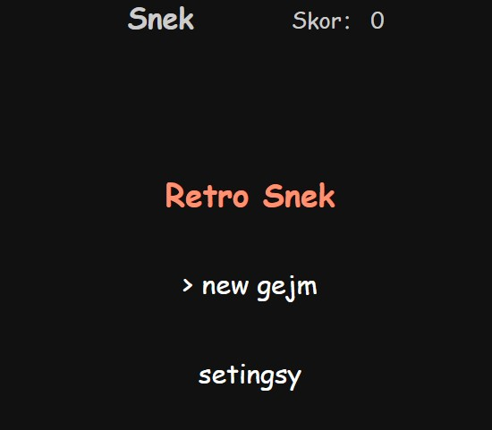

# Retro Snek

<p align = "center"> Czysty nawigacyjny JavaScript w połączeniu z canvą ， brak zależności </p>

Wyniki przedstawiono w następujący sposób ：
# Wygląd
<p align = "center">  </p>

# Próbny

[Gra demonstracyjna](https://janko320000.github.io/Snek./)

# Jak używać
Możesz także sklonować ten projekt i wypróbować go lokalnie

```
clone git https://github.com/janko320000/Snek..git
```

lub użyj „.zip”

Myślę, że skupiamy się na idei programu, nie kompresuję, możesz zobaczyć oryginalny JS

# O ustawieniach

<p align = "">
  
  
</p>

Główna funkcja:

1. Możesz wybrać ścianę jako przeszkodę 「on」(on)  lub 「of」(off)

2. Możesz wybrać prędkość poruszania się węża 「Sloł」(Wolne) 「Normal」(Normalne)  lub 「Fast」(Szybkie)

3. Możesz wybrać język 「Origin」(Oryginalny) 「Polisz」(Polski)  lub 「Inglisz」(Angielski)

A pozostałe zasady są takie same, jak zasady węża stosowane w dzieciństwie

Jak na przykład:

- Możesz zjeść swoje ciało lub uderzyć w ścianę, aby się zabić （pod modelem ściany）
- W zależności od tego, ile jesz, aby zwiększyć długość węża
